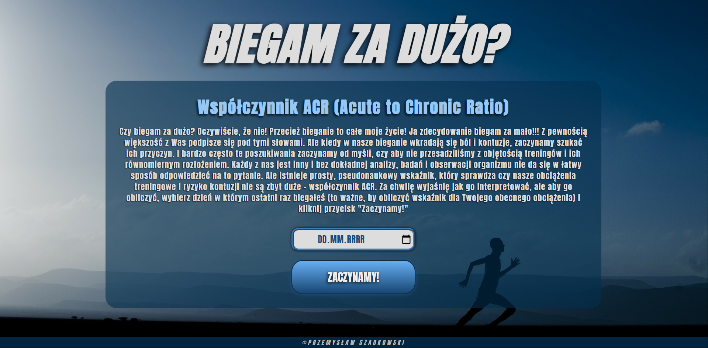
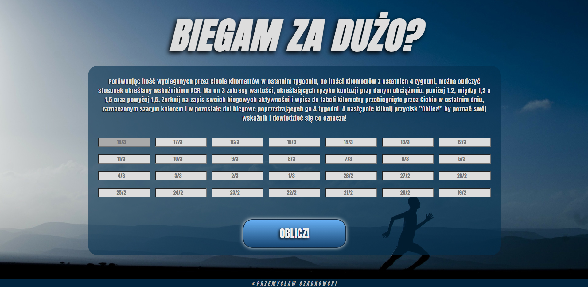
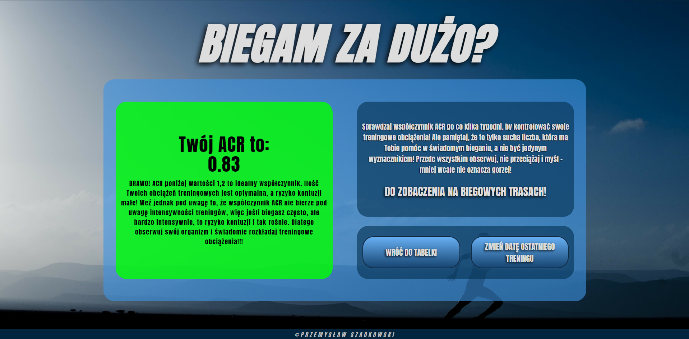

# biegamzglowa
> App for runners which calculate ACR ratio and helps improves running training.

## Table of contents
* [Colors key](#colors-key)
* [General info](#general-info)
* [Screenshots](#screenshots)
* [Technologies](#technologies)
* [Features](#features)
* [Inspiration](#inspiration)
* [Contact](#contact)

## Colors-key

## General info

App calculates Acute-To-Chronic ratio. It helps to stay injure free.

All information about ACR - https://www.runnersworld.com/training/a20841513/acute-to-chronic-training-ratio-calculator/

It sums up kilometers from 4 week and then divide it by last week kilometers and calculates and shows result in a proper way.

## Screenshots

### Main view

### All day inputs

### Result window

## Technologies
* HTML
* CSS
* Javascript
* React

## Features

To do:
* fix up RWD and design on mobile devices

Live demo https://przemek-szadkowski.github.io/biegamzglowa/

## Status
Project is: finished

## Inspiration
Project inspired by my running friends.

## Contact
Created by [przemoszadkowski@o2.pl](mailto:user@example.com) - feel free to contact me!